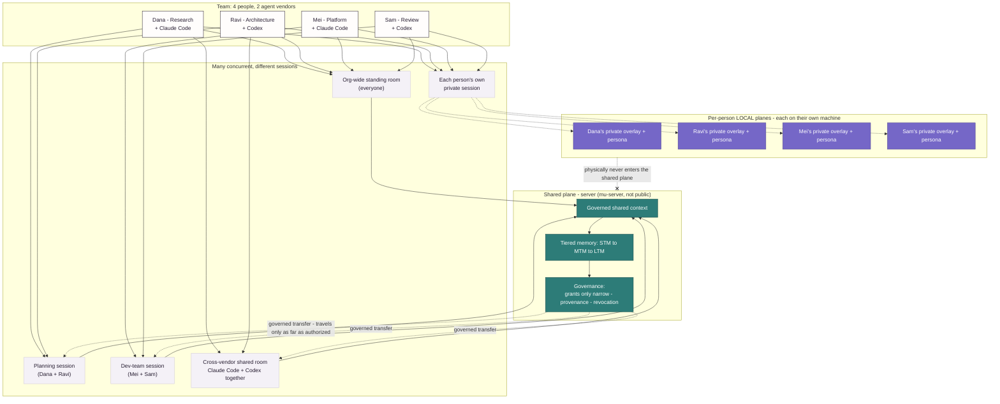
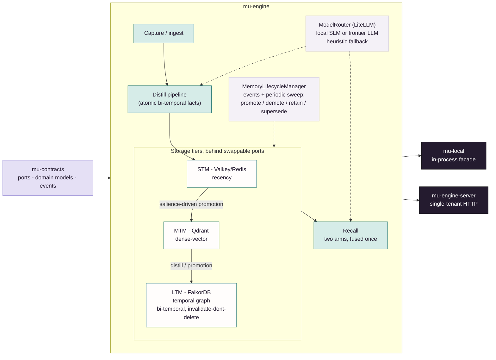

# mu-core

**Shared memory for teams that don't share one agent.**

`mu-core` is the open engine underneath that: three real memory tiers with a real lifecycle,
pluggable storage backends behind ports, and a multi-provider model router with a credential-free
local path — a complete on-device memory system that needs no server, no account, and no API key.

Part of [Memory Universe](https://github.com/MemoryUniverse) · Apache-2.0 · Python 3.12+

## Why another memory engine?

Long-horizon agent memory is being solved, and solved well, by several projects. What none of them
solve is the moment a **second person** joins the project: memory stays bound to one person, in one
session, on one vendor. There is no way to contribute into a teammate's session, or draw from one on
terms either of you set — so the handoff falls back to a pasted transcript.

Memory Universe is built for that case. People contribute into sessions and draw from them on their
own terms; every teammate keeps the agent they chose and a private plane that never leaves their
machine; and anything shared carries provenance, scope, an expiry, and a revoke switch. This repo is
the half of that which runs entirely on your own machine, today.

> **Status: early, under active development.** The engine in this repo is built and dogfooded daily
> against real Claude Code and Codex sessions through `mu-client`, with unit tests plus integration
> tests that run against real Qdrant / FalkorDB / Valkey containers rather than mocks. The hosted,
> multi-tenant, governed-sharing plane it is designed to plug into (`mu-server`) is **not public**,
> so anything involving other people, other tenants, or other devices is designed and not usable
> here. A private beta has **not started** — we are recruiting design partners for one. See
> [Built vs. designed](#built-vs-designed-read-this-before-you-evaluate-it).

## The vision

Memory Universe is the persistent collaborative session and memory layer for teams of people *and*
their AI agents — across users, devices, agents, and vendors. Your project's context — decisions,
evidence, open threads, what your agent already learned — should survive the handoff across
sessions, teammates, machines, and agent vendors, and should travel only as far as it was actually
authorized to go. A team, in this model, means people plus the different
coding agents they each prefer: Claude Code, Codex, and others as the architecture grows.



`mu-core` is the part of that vision that has no dependency on anyone else's server, account, or
trust: a real, working memory engine you can run entirely on your own machine today. The left half
of that diagram is this repo. The right half is not, and is not public.

## What's in this repo

A `uv` workspace shipping four Apache-2.0 Python packages, in dependency order:

| Package | What it is |
|---|---|
| **`mu-contracts`** | The lean shared vocabulary: pydantic domain models, ports/protocols, the event catalog, wire schemas, the error hierarchy, and the config base. Pydantic-only — no engine, no stores, no strategies. This is the versioned surface every other Memory Universe package pins against, including the SDKs and `mu-server`. |
| **`mu-engine`** | The full memory engine: the three storage tiers behind swappable ports, ingest / recall / lifecycle / conflict / persona / pin / health services, the distill pipeline, the multi-provider model router, and `SurfaceFacade` — the one verb surface everything else is a projection of. |
| **`mu-local`** | `LocalMemory`: the embedded, in-process, daemonless facade over `mu-engine`. One async object, no daemon, no server, no network. This is what `mu-client` runs on-device. |
| **`mu-engine-server`** | A thin, single-tenant HTTP server over the same `SurfaceFacade`, with a `Dockerfile`, a `Makefile` and compose files. Depends on `{mu-contracts, mu-engine}` only. **Run it, then point either SDK at it** — this is the open reference server, and today it is the practical way to use the SDKs for real. |

Nothing here is server-only. Cross-user governance, ACLs, multi-tenant rooms, the gateway edge, the
sync hub, and metering all live in `mu-server` (private, commercial). That is deliberate — they are
not here, and the engine is not degraded by their absence.

### The parts worth reading

- **Three tiers with a real lifecycle, not one flat vector store.** An STM key/value floor, an MTM
  dense-vector tier, and an LTM temporal knowledge graph. `MemoryLifecycleManager` drives it on a
  dual trigger — bus events *and* a periodic sweep — with promotion, demotion, retention, and a
  salience signal that includes how connected a fact is in the graph
  (`lifecycle/salience.py`, `lifecycle/centrality.py`).
- **Bi-temporal memory, invalidate-don't-delete.** The distill pipeline extracts atomic facts into
  the graph tier and resolves contradictions: a superseded fact is marked invalid *as of* a point in
  time and retained, so history stays traversable. Conflict handling can supersede, keep both, or
  route to a manual inbox for what should not be decided automatically.
- **`pin` is enforced at one guard, not sprinkled through callers.** `lifecycle/policy.py` holds
  the single clause; every exit site asks it. A pinned memory is never the automatic loser.
- **Two-arm recall, fused once.** The private arm is authorized *by partition* — no id list needed,
  because only your data is in it — and the shared arm by an explicit authorized-id set; they are
  fused and deduplicated at the end (`services/recall/authz.py`, `fusion.py`). The private/shared
  boundary is a physical partition derived from the namespace, not a `WHERE` clause, so a filter bug
  cannot cross it.
- **Pluggable stores, refused at build time when wrong.** `StoreRegistry` is a role → backend →
  factory dispatch; `assert_mandatory_roles` refuses to build a container with `vector`, `graph` or
  `relational` unbound. Shipped backends: **relational** postgres / sqlite / mysql · **vector (MTM)**
  qdrant / pgvector / chroma / weaviate / faiss · **graph (LTM)** falkordb · **kv (STM)** redis /
  valkey / memcached / in-memory · **artifact** filesystem.
- **A multi-provider model layer with a credential-free local path.** One task → logical model group
  → many deployments map, compiled into a LiteLLM router. A local OpenAI-compatible row sits in
  every group whose task local models are actually good at, and in a sibling fallback group
  elsewhere; the hard-reasoning group deliberately gets **no** local row, because ADR 0037 says
  adjudication must degrade to a named deterministic heuristic rather than to a weaker model.
  The shipped defaults are an *empty* catalog plus an offline MiniLM embedder — adopting the
  logical groups is one opt-in call (`recommended_model_settings()`). With no model configured at
  all the engine runs in heuristic mode and refuses LLM-dependent verbs by name rather than
  fabricating an answer.
- **Content-free discipline.** No memory content in logs, traces, the event bus, or metering —
  events carry ids, hashes, counts, and enums.

Test surface, as of this commit: 163 test files and roughly 1,430 test functions across the four
packages. The integration suites talk to real containers (`docker-compose.dev.yml` brings up a
dedicated `mu-dev-*` stack) — for example `tests/storage/test_graph_falkor_int.py`,
`tests/lifecycle/test_lifecycle_auto_drive_int.py`, `tests/pipelines/test_crash_replay_resume_int.py`.

## Quickstart

> **Clone `dev/mlm-build`, not the default branch.** GitHub's default branch here is `main`, and
> `main` is stale in a way no install tool will warn you about — `uv sync` exits `0` on it. Two
> concrete things are missing there: `mu_contracts.contracts` is still the empty scaffold
> (`__init__.py` and nothing else), so `import mu_contracts.contracts.recall` raises
> `ModuleNotFoundError`; and `packages/mu-engine-server/` does not exist at all, so the `make up`
> block further down is a `cd: no such file or directory`. Anything built on a `main` clone —
> `mu-client`, `mu-sdk-python` — therefore installs cleanly and then crashes on its first command.
> `dev/mlm-build` is the trunk this README describes and every command here is verified against it.
> Landing trunk on `main` is the real fix and is pending an owner decision; until it lands, `-b` is
> not optional.

```bash
git clone -b dev/mlm-build https://github.com/MemoryUniverse/mu-core
cd mu-core
uv sync --group dev

# The engine binds REAL stores by default — bring them up before the snippet below.
docker compose -f docker-compose.dev.yml up -d     # dedicated mu-dev-* Valkey, Qdrant, FalkorDB
```

Use `LocalMemory` directly, in-process, no daemon:

```python
import asyncio
from mu_local import LocalMemory

async def main() -> None:
    async with LocalMemory(workspace="local", namespace="default") as memory:
        await memory.add("The staging DB migration runs Tuesdays at 02:00 UTC.")
        result = await memory.recall("when does the migration run?")
        for item in result.items:
            print(item.fused_score, item.tier, item.content)

asyncio.run(main())
```

`LocalMemory` exposes `add`, `consolidate`, `recall`, `search`, `get`, `context`, `ask`, `promote`,
`demote`, `update`, `delete`, plus the `health` and `pin` services — all async, with an
`async with` lifecycle.

**What it needs to run.** By default it binds SQLite for the control plane, a Redis/Valkey-compatible
KV floor for STM, Qdrant for the MTM vector tier, FalkorDB for the LTM graph, and a local
sentence-transformer embedder (`mu-local/config.py`). Those three container stores are **required,
not optional** — `StoreRegistry.assert_mandatory_roles` refuses to build a container with `vector`,
`graph` or `relational` unbound, so `uv sync` alone is not enough and the `docker compose` line
above is the prerequisite, not a nicety. What you do *not* need is a cloud account, an API key, or
any Memory Universe server.

**Using `mu-core` from another project.** Nothing here is published to a registry yet — the four
distributions (`mu-contracts`, `mu-engine`, `mu-local`, `mu-engine-server`) exist only in this
repo. A `uv sync` inside a fresh `mu-core` clone needs no sibling and no registry, but consuming
the engine *from your own project* currently takes explicit git URLs:

```bash
uv pip install \
  "mu-contracts @ git+https://github.com/MemoryUniverse/mu-core@dev/mlm-build#subdirectory=packages/mu-contracts" \
  "mu-engine    @ git+https://github.com/MemoryUniverse/mu-core@dev/mlm-build#subdirectory=packages/mu-engine" \
  "mu-local     @ git+https://github.com/MemoryUniverse/mu-core@dev/mlm-build#subdirectory=packages/mu-local"
```

The `@dev/mlm-build` in each URL is load-bearing for the same reason the `-b` above is: drop it and
uv resolves the stale default branch, installs 100-odd packages without complaint, and leaves you
with a `mu_contracts` that has no `contracts.recall` to import.

Naming all three is required: each one's metadata refers to the others by name, and with nothing
published under those names a resolver has nowhere else to look. (`mu-core` itself is a *virtual*
uv workspace root, not a distribution — there is no `pip install mu-core`.)

Prefer HTTP? `mu-engine-server` is the same engine behind a small FastAPI surface:

```bash
cd packages/mu-engine-server
make up          # mints a local bearer token, then brings the compose stack up
curl -s http://127.0.0.1:8300/health
```

Use `make up`, not a bare `docker compose up`: every route except `/health` is behind
`Depends(require_bearer_token)`, and the token is minted to `~/.memory-universe/engine-server.token`
by the `mint-token` prerequisite of `make up`. Skipping it gets you a server that reports healthy
and then `401`s every real call. The SDKs auto-load that token in `local_server` mode.

It serves an unauthenticated `GET /health`, plus — all bearer-authenticated — `POST /memories`,
`GET`/`PUT`/`DELETE /memories/{id}`, `POST /v1/memories/recall`, `POST /v1/memories/consolidate`,
`POST /v1/memories/{id}/promote` and `/demote`, `POST /v1/context/window`, `GET /profile`,
`POST /lifecycle/enforce`, and `GET /lifecycle/events`. There is no `/search`, `/ask` or `/share`
route — those verbs exist in the SDKs but no server here pins them yet, and they raise rather than
degrade. Point [`mu-sdk-python`](https://github.com/MemoryUniverse/mu-sdk-python) or
[`mu-sdk-js`](https://github.com/MemoryUniverse/mu-sdk-js) at it in `local_server` mode.

If you want capture hooks into Claude Code / Codex, a daemon, a CLI, and MCP tools on top of this
engine, see [**`mu-client`**](https://github.com/MemoryUniverse/mu-client).

## Architecture, in one paragraph



`mu-core` implements a brain-inspired STM → MTM → LTM hierarchy behind clean ports, so storage
backends are swappable without touching engine logic. Salience-driven promotion moves memory up the
hierarchy and demotion moves it back down; the distill pipeline extracts atomic facts into the graph
tier with bi-temporal invalidate-don't-delete supersession, so a fact that changes is marked invalid
as of a point in time rather than removed, and history stays queryable. Recall runs two
independently-authorized arms — private by physical partition, shared by an explicit id set — and
fuses them once; no cross-plane store handle is ever opened. Model access goes through a
LiteLLM-backed `ModelRouter`, so the same engine runs against a warm local small model or a frontier
API model behind one interface, and it works in heuristic (no-LLM) mode too, refusing loudly instead
of degrading into a fabricated answer.

## Built vs. designed: read this before you evaluate it

- **Built and dogfooded today:** all four packages above — the three tiers, promotion/demotion/
  retention, bi-temporal conflict resolution with a manual inbox, pin, memory health, persona, the
  pluggable store registry, the multi-provider model router, `LocalMemory`, and the dockerized
  `mu-engine-server` — exercised end to end by `mu-client` against real hook-captured Claude Code and
  Codex activity, by both SDKs, and by internal LangGraph demo agents, with integration tests against
  real containers.
- **Deliberately absent, and it says so by name:** the private→shared crossing. `SurfaceFacade.share`
  raises `SurfaceVerbNotImplementedError` rather than pretending — the crossing is a `mu-server`
  concept and the engine will not fake one. (Both SDKs *do* ship a typed `share()` client method, but
  no server in or out of this repo answers it.) `LocalMemory` is private-plane-only by construction;
  every shared-plane field handed to it is rejected, not silently dropped.
- **Designed, not in this repo, not yet public:** `mu-server`, the hosted plane that adds multi-tenant
  governance, live shared rooms, per-fragment provenance, revocable sharing grants, cross-device sync,
  and cross-vendor bound-agent participation. That is genuinely new, unshipped work; nothing in this
  repo should be read as implying it already exists.

## Where this fits

Part of **Memory Universe**: [github.com/MemoryUniverse](https://github.com/MemoryUniverse).

| Repo | Role |
|---|---|
| **mu-core** (this repo) | The open engine: contracts, engine, local facade, reference HTTP server |
| [`mu-client`](https://github.com/MemoryUniverse/mu-client) | The on-device daemon: hook capture for Claude Code and Codex, injection, CLI, MCP |
| [`mu-sdk-python`](https://github.com/MemoryUniverse/mu-sdk-python) | Python developer SDK: typed wire client, plus an in-process embedded mode |
| [`mu-sdk-js`](https://github.com/MemoryUniverse/mu-sdk-js) | JavaScript/TypeScript developer SDK, wire-parity with the Python SDK |
| `mu-server` (private) | The hosted, governed, multi-tenant plane: the commercial part |

## License

Apache-2.0 (see `LICENSE`). A deliberate open-core structure: `mu-core`, `mu-client`, and both SDKs
are fully open and stay full-quality; the local engine is never crippled to push you toward a paid
tier. `mu-server` — the hosted plane that exists specifically because other tenants, other people's
data, and billing are involved — is the commercial product built on top.

## Background

Independent, early-stage work: the productization of roughly a year of the founder's
graduation-thesis research into multi-user agentic memory (the STM/MTM/LTM hierarchy and the
namespace model here trace directly back to it). No company yet and no customers to point to — just
an engineer building the open memory layer he thinks agent teams are going to need, in public.

## Contact

- GitHub: [@TRextabat](https://github.com/TRextabat)
- Email: amiramiritabat01@gmail.com

## Links

- Organization: [github.com/MemoryUniverse](https://github.com/MemoryUniverse)
- How it works, in six diagrams: [Memory Universe Mechanics](https://claude.ai/code/artifact/4127edfb-bd56-462b-9cb5-2f5d3ea4e3c4)
- Issues / discussion: use this repo's GitHub Issues
- License: [Apache-2.0](./LICENSE)
