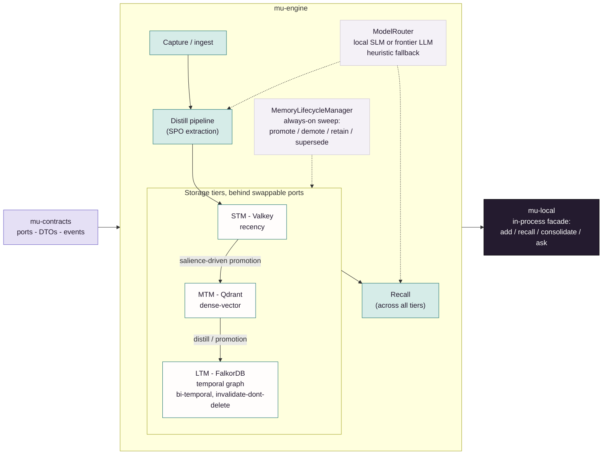

# mu-core

The complete Memory Universe engine and the contracts every other package speaks.

Part of [Memory Universe](https://github.com/MemoryUniverse).

**The open memory engine at the heart of Memory Universe.** Tiered short/mid/long-term memory,
real storage adapters, no server required to get value from it.

> **Status: early, under active development (private beta in progress).** The engine in this repo
> is built and dogfooded daily. The hosted, multi-tenant, governed-sharing plane it plugs into
> (`mu-server`) is designed but not yet public. See [Where this fits](#where-this-fits).

## The vision

Memory Universe is a persistent, governed context layer for teams of people *and* their AI agents.
The idea: your project's context (decisions, evidence, open threads, what your agent already
learned) should survive the handoff across sessions, teammates, machines, and even agent vendors,
and it should travel only as far as it was actually authorized to go. A team, in this model, means
people plus the different coding agents they each prefer: Claude Code, Codex, and others as the
architecture grows.


`mu-core` is the part of that vision that has no dependency on anyone else's server, account, or
trust: a real, working memory engine you can run entirely on your own machine today.

## What's in this repo

`mu-core` is a `uv` workspace shipping three Apache-2.0 Python packages, in dependency order:

| Package | What it is |
|---|---|
| **`mu-contracts`** | The lean shared vocabulary: pydantic DTOs, the event catalog, wire schemas, ports/protocols, the error hierarchy, and config base. Pydantic-only: no engine, no stores, no strategies. This is the versioned surface every other Memory Universe package (`mu-client`, the SDKs, eventually `mu-server`) pins against. |
| **`mu-engine`** | The full memory engine: storage tiers and façades, ingest/recall/promotion/demotion/conflict services, the pipelines framework, and working baseline strategies. This is what makes a fully local deployment a *complete* system, not a stub. |
| **`mu-local`** | `LocalMemory`: the embedded, in-process, daemonless facade over `mu-engine`. One object, a handful of async verbs (`add`, `recall`, `search`, `consolidate`, `ask`, `context`), no daemon, no server. |

Nothing in `mu-core` is server-only. Governance, ACLs, multi-tenant rooms, the gateway, sync-hub,
and metering all live in `mu-server` (private, commercial). That's deliberate; they're not here.

## Quickstart

```bash
git clone https://github.com/MemoryUniverse/mu-core
cd mu-core
uv sync --group dev
```

Use `LocalMemory` directly, in-process, no daemon:

```python
import asyncio
from mu_local import LocalMemory

async def main() -> None:
    async with LocalMemory(workspace="local", namespace="default") as memory:
        await memory.add("The staging DB migration runs Tuesdays at 02:00 UTC.")
        result = await memory.recall("when does the migration run?")
        for item in result.items:
            print(item.score, item.tier, item.content)

asyncio.run(main())
```

By default `LocalMemory` runs against real local stores (Valkey for the short-term floor, Qdrant
for the mid-term vector tier, FalkorDB for the long-term graph) and a local sentence-transformer
embedder. No cloud account needed to try it. `docker-compose.dev.yml` brings up a dedicated
`mu-dev-*` container stack for development and integration testing.

If you only want the memory engine embedded in your own on-device tool, `mu-local` is the smallest
useful entrypoint. If you want capture hooks into Claude Code/Codex, a daemon, and a CLI on top of
this engine, see **`mu-client`**.

## Architecture, in one paragraph



`mu-core` implements a brain-inspired STM → MTM → LTM memory hierarchy behind clean ports, so
storage backends are swappable without touching engine logic: an STM floor (Valkey-compatible
key/value + recency), an MTM dense-vector tier (Qdrant, with Chroma/FAISS/pgvector also supported
through the same port), and an LTM temporal knowledge graph (FalkorDB, with bi-temporal
invalidate-don't-delete supersession: a fact isn't deleted when it changes, it's marked invalid as
of a point in time and superseded by the new one, so history stays queryable). Salience-driven
promotion moves memory up the hierarchy; a distill pipeline extracts subject-predicate-object facts
into the graph tier. Model access goes through a LiteLLM-backed `ModelRouter`, so the same engine
runs against a local small model or a frontier API model behind one interface. The engine works in
heuristic (no-LLM) mode too and never silently degrades to a fabricated answer.

## Built vs. designed: read this before you evaluate it

- **Built and dogfooded today:** all three packages above, exercised end to end by `mu-client`
  (real hook-captured activity from live Claude Code sessions), both SDKs, and internal LangGraph
  demo agents, with unit tests plus integration tests against real (non-mocked) containers.
- **Designed, not in this repo, not yet public:** `mu-server`, the hosted plane that adds
  multi-tenant governance, live shared rooms, per-fragment provenance, revocable sharing grants, and
  cross-vendor bound-agent participation. That is genuinely new, unshipped work; nothing in this
  repo should be read as implying it already exists. It's the commercial, closed part of an
  open-core model (see below).

## Where this fits

Part of **Memory Universe**: [github.com/MemoryUniverse](https://github.com/MemoryUniverse).

| Repo | Role |
|---|---|
| **mu-core** (this repo) | The open engine: contracts, engine, local facade |
| [`mu-client`](https://github.com/MemoryUniverse/mu-client) | The on-device daemon: hook capture for Claude Code/Codex, injection, CLI |
| [`mu-sdk-python`](https://github.com/MemoryUniverse/mu-sdk-python) | Python developer SDK: the wire client for building on top of Memory Universe |
| [`mu-sdk-js`](https://github.com/MemoryUniverse/mu-sdk-js) | JavaScript/TypeScript developer SDK, parity with the Python SDK |
| `mu-server` (private) | The hosted, governed, multi-tenant plane: the commercial part |

## License

Apache-2.0 (see `LICENSE`). This is a deliberate open-core structure: `mu-core`, `mu-client`, and
both SDKs are fully open and stay full-quality; the local engine is never crippled to push you
toward a paid tier. `mu-server`, the hosted plane that exists specifically because other tenants,
other people's data, and billing are involved, is the commercial product built on top.

## Background

Memory Universe is independent, early-stage work: the productization of about a year of the
founder's graduation-thesis research into multi-user agentic memory (the brain-inspired STM/MTM/LTM
hierarchy and namespace model here trace directly back to that research). There's no company yet
and no customers to point to, just an engineer building the open memory layer he thinks agent teams
are actually going to need, in public.

## Contact

- GitHub: [@TRextabat](https://github.com/TRextabat)
- Email: amiramiritabat01@gmail.com

## Links

- Organization: [github.com/MemoryUniverse](https://github.com/MemoryUniverse)
- Issues / discussion: use this repo's GitHub Issues
- License: [Apache-2.0](./LICENSE)
